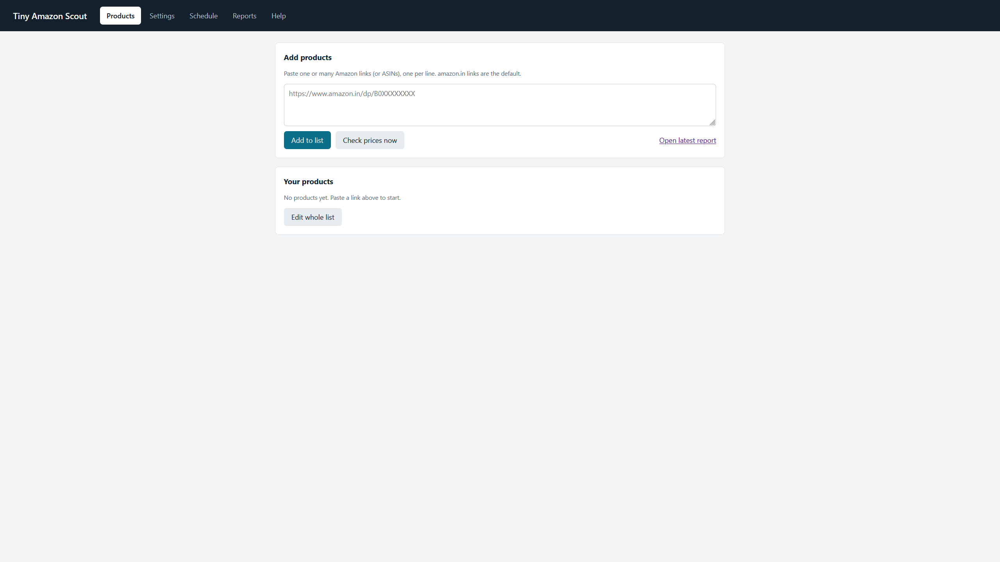
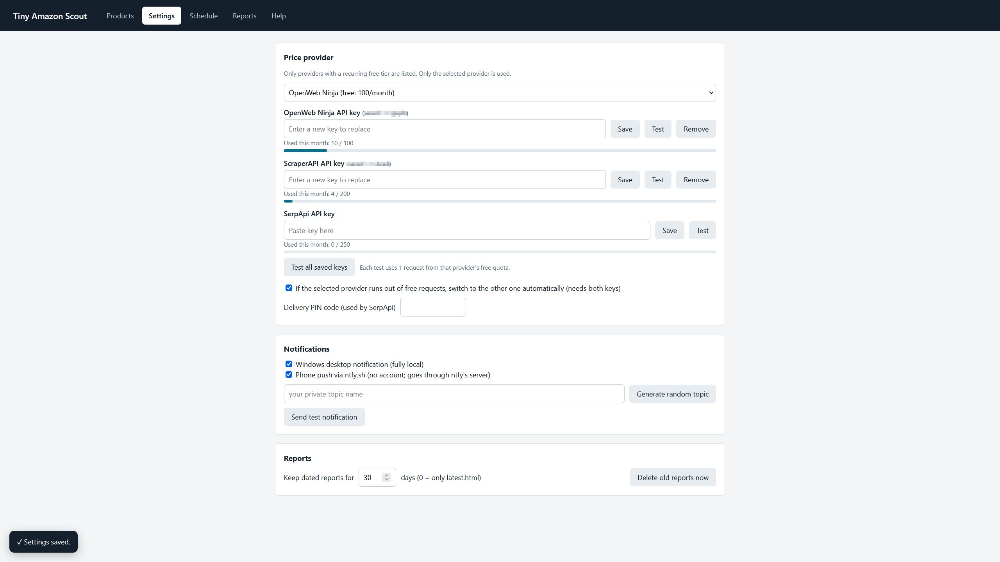
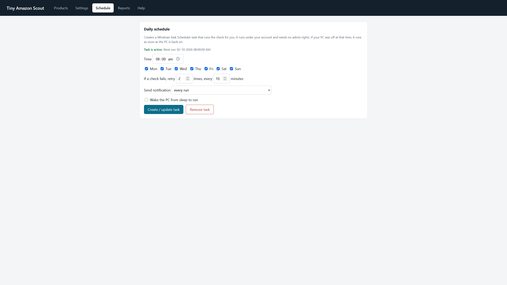

# Tiny Amazon Scout

A small local app that checks Amazon product prices once a day through a free price API and sends you a report. Windows-first, no `pip install` needed (Python standard library only).

## Features
- Add and remove Amazon links in a browser UI. Paste many at once or edit the whole list in one box.
- Free-tier providers only, shown in this order: **OpenWeb Ninja** (100 requests/month), **ScraperAPI** (1,000 credits/month, about 200 Amazon requests) and **SerpApi** (about 250/month, asks for phone verification at signup). Check their pricing pages, as limits can change.
- **Test** button on every API key plus **Test all saved keys** (each test uses 1 request).
- Automatic fallback to the other provider when the selected one runs out of free requests (needs both keys).
- Price history, change since last check, lowest/highest seen, optional target price, free/paid delivery.
- HTML report saved after every check, with automatic cleanup of old reports.
- Notifications through a Windows desktop popup and/or [ntfy](https://ntfy.sh) phone push (no account needed).
- Create or remove the daily Windows Task Scheduler task from the UI, with day selection, retries on failure, wake-from-sleep and "notify only on changes".

## Screenshots

## Quick start
1. Install Python 3.8+ from python.org (tick "Add python.exe to PATH").
2. Double-click `start.bat`. The UI opens at http://127.0.0.1:8765. Close the console window to stop it.
3. **Settings**: pick a provider and paste its API key (see the Help tab for how to get one).
4. **Products**: paste your links, click **Check prices now**.
5. **Schedule**: choose a time and click **Create / update task**.

## Where files go
Everything stays in this folder: `data/tracker.db` (products, history, settings including API keys), `data/run.log`, `reports/`.
Both `data/` and `reports/` are in `.gitignore`. Never commit them, since they contain your API keys.

## Notes
- Delivery info depends on what the provider returns and on the PIN code (SerpApi only); it shows "unknown" when missing.
- The monthly usage counter is counted locally by the app, not by the provider.
- Retries after a failure also use API requests.

## Changelog
### 1.2.2 - 2026-10-01
- Added screenshots (`samples/` folder) to the README.

### 1.2.1 - 2026-10-01
- Activity card in the bottom-left corner: spinner while a button's action is running, then a tick or cross with the result.

### 1.2.0 - 2026-10-01
- Added ScraperAPI provider; SerpApi moved to the end of the list. (Canopy API was dropped: its free tier needs a credit card.)
- Test button per API key and a Test all button.
- Requests now send a browser-style User-Agent.

### 1.1.0 - 2026-10-01
- Renamed to **Tiny Amazon Scout**; added `start.bat`, README.
- Currency now shown with a space (`INR 331.00`).
- Scheduler options: weekdays, retry count and delay, wake PC, notify only on changes.
- Free/paid delivery column in the UI and report.
- Automatic provider fallback when a free quota is used up.

### 1.0.0
- First version: product list, two free providers, ntfy and desktop notifications, HTML reports, Task Scheduler management.
